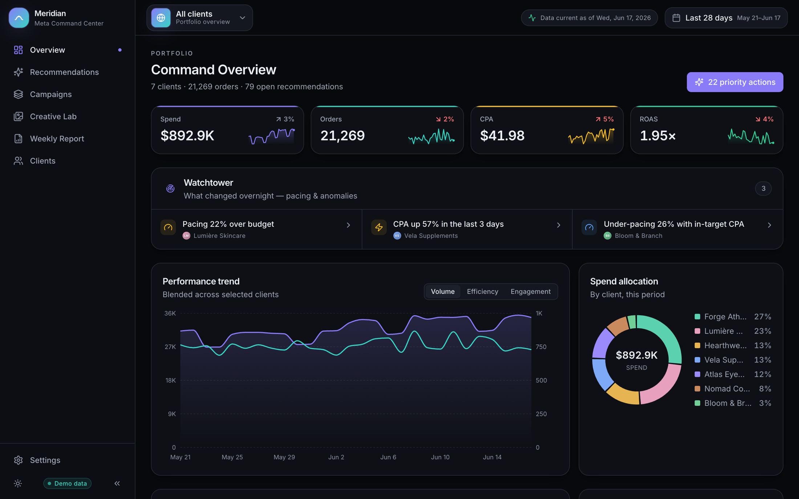
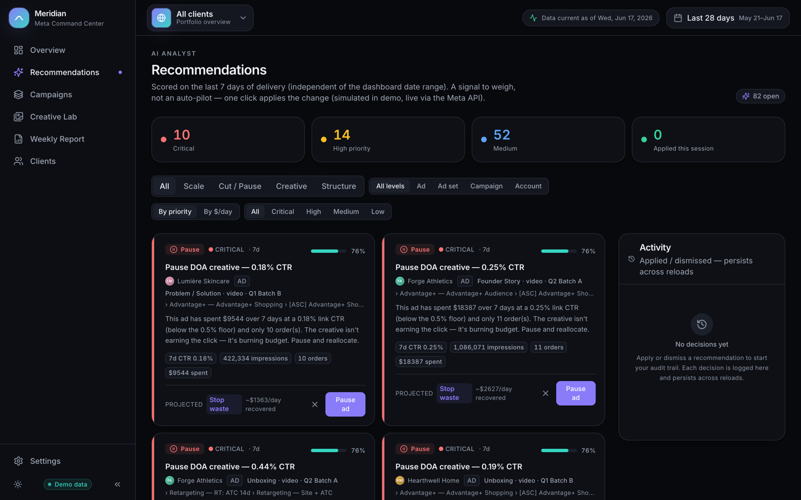
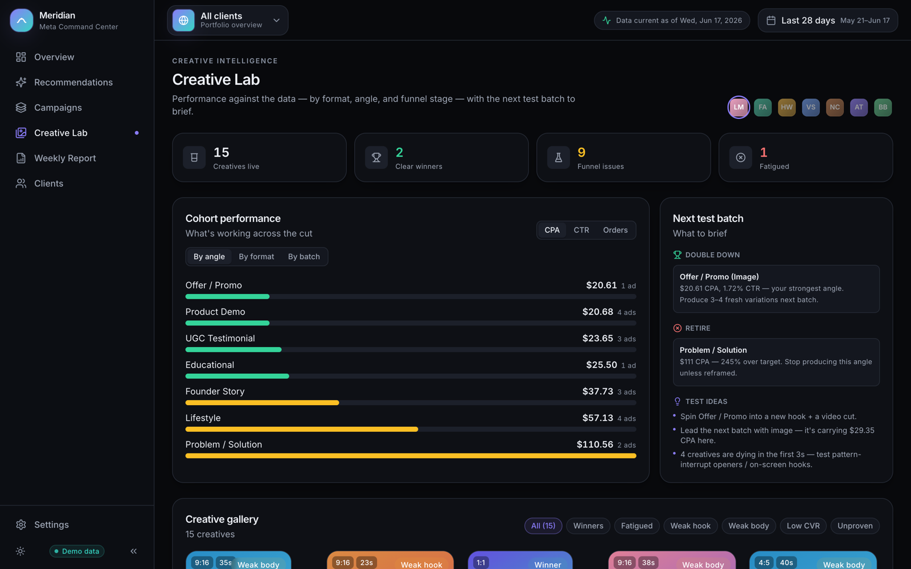
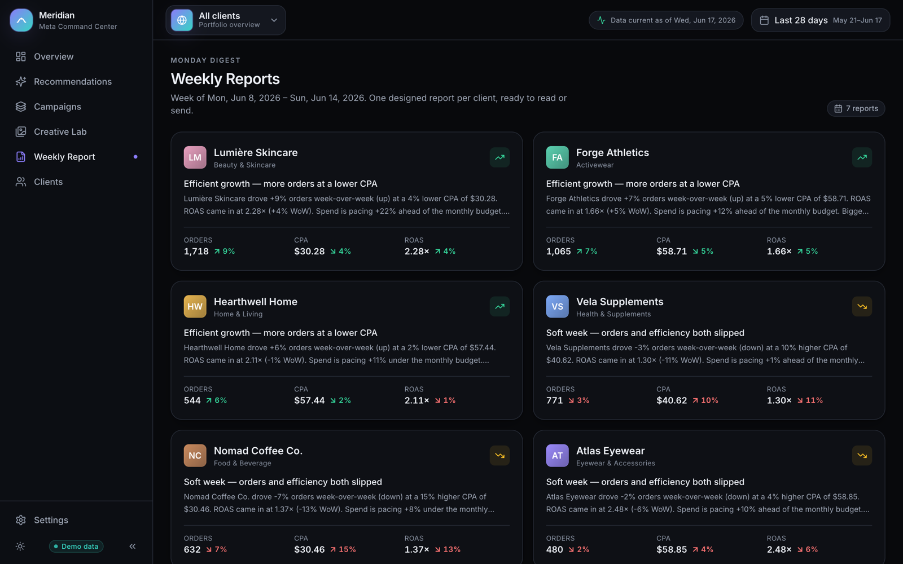
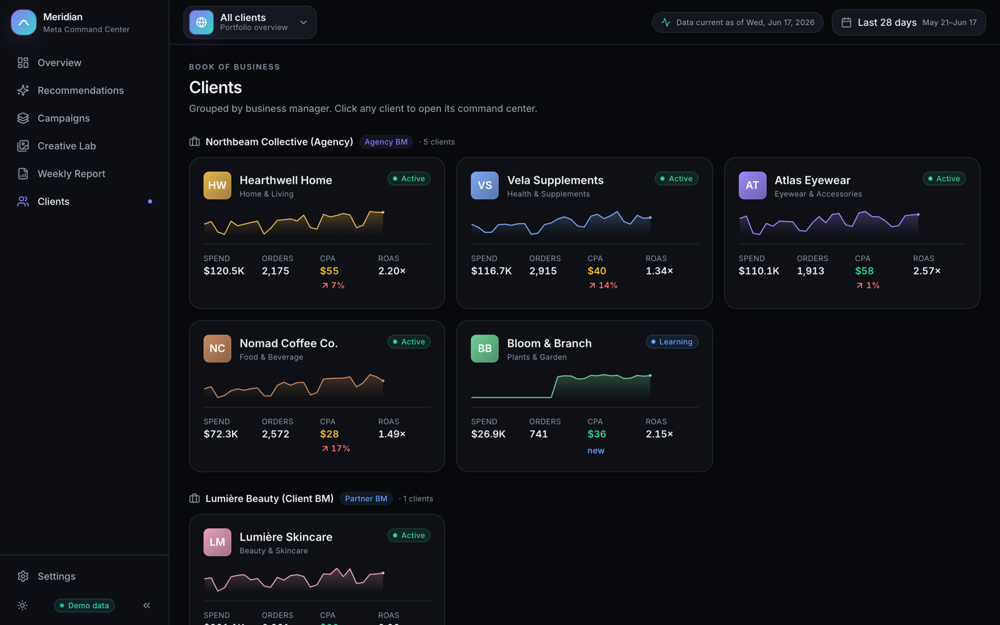

<div align="center">

# Meridian

**An internal AI command & control center for agency Meta advertising.**

One cockpit across every client and Business Manager · KPI dashboards down to the
creative · an AI analyst that scores the data and proposes one-click optimizations
· designed weekly Monday reports.

<br />



</div>

---

## Quick start

```bash
npm install
npm run dev      # → http://localhost:5173
```

Ships in **demo mode** — a deterministic, seeded dataset of 7 clients across 3
Business Managers, ~26 campaigns and 90 days of ad-level performance — so you can
poke around before any API is connected. No keys required.

```bash
npm run build    # typecheck + production build
npm run lint     # typecheck only
```

## What's inside

| Area | Where |
|---|---|
| **Portfolio overview** — cross-client KPIs, spend allocation, priority actions | `/` |
| **Single-client dashboard** — KPIs vs targets, trends, campaigns, pacing | `/` (client scope) |
| **Recommendations** — AI suggestions, filterable, one-click apply | `/recommendations` |
| **Campaigns** — campaign → ad set → ad drill-down | `/campaigns` |
| **Creative Lab** — cohort analysis, funnel diagnosis, next test batch | `/creatives` |
| **Weekly Report** — designed Monday report per client + portfolio digest | `/report` |
| **Clients** — directory grouped by Business Manager | `/clients` |
| **Settings** — Meta connection, ad-account mapping, AI + thresholds | `/settings` |

## Screens

<sub>Shown in demo mode — the seeded dataset of fictional clients with deterministic numbers. Click any image for full resolution.</sub>

|  |  |
| :--: | :--: |
| <a href="docs/screenshots/recommendations.png"></a> | <a href="docs/screenshots/creative-lab.png"></a> |
| **Recommendations** — the AI analyst scores delivery and proposes filterable, one-click actions | **Creative Lab** — cohort analysis by angle, funnel diagnosis, and the next test batch to brief |
| <a href="docs/screenshots/weekly-report.png"></a> | <a href="docs/screenshots/clients.png"></a> |
| **Weekly Reports** — a designed Monday digest per client, headline written from the data | **Clients** — the book of business, grouped by Business Manager |

## Architecture (built to "turn the lights on")

The entire UI reads through one **`DataProvider`** seam. `DemoProvider` ships now;
`LiveProvider` is a wired Meta Marketing API client scaffold. The **AI engine**
(`src/lib/ai/`) runs on heuristics with zero keys; an LLM narrative layer is
scaffolded. Switch demo → live in **Settings**; full wiring guide in
[`docs/META_INTEGRATION.md`](docs/META_INTEGRATION.md).

```
src/
  lib/
    types.ts            domain model (mirrors the Meta object graph)
    demo/               deterministic seeded dataset generator
    metrics.ts          KPI derivations + date math
    selectors.ts        entity → insights → metrics
    provider/           DataProvider seam: demo + live(scaffold)
    ai/                 engine (heuristics) · creative · report · llm(scaffold)
  components/           ui primitives · charts · blocks · shell
  screens/              the pages
  app/                  store (zustand) · router · shell
docs/                   see docs/README.md for the index — engineering guides
                        (META_INTEGRATION · LEDGER · live-integration pack),
                        API/ad-ops reference (research/), audit evidence (audit/),
                        and build-process artifacts
```

**New here?** [`docs/README.md`](docs/README.md) indexes every doc by purpose.

## Honest status

This is a **near-finish-line first draft**, not a finished or market-validated
product. What's verified-working, what's scaffolded for your API, and what's
simulated in demo is tracked transparently in
[`docs/LEDGER.md`](docs/LEDGER.md). Read it before trusting any single claim.

Stack: React 18 · TypeScript · Vite · Tailwind · Recharts · Zustand.
